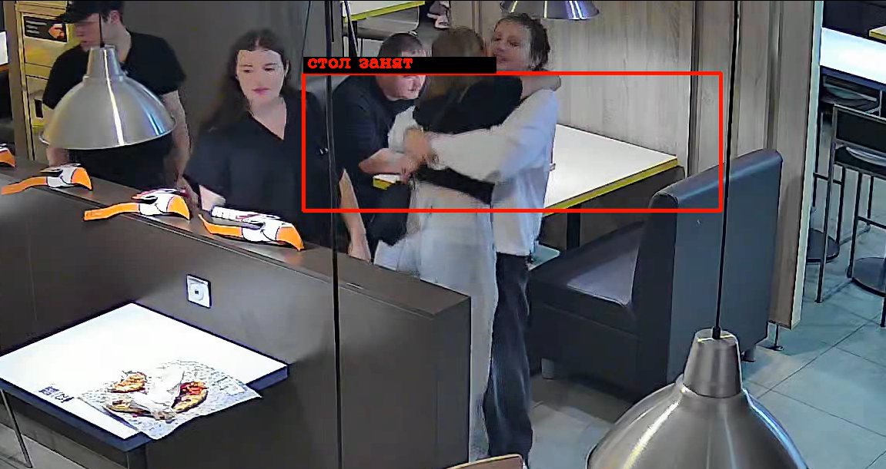

## Шаги для запуска проекта:
1. Установить и активировать виртуальную среду (venv)
2. В терминале выполнить команду `pip install -r requirements.txt`
3. Запустить файл main.py через графический интерфейс компилятора или через команду `python main.py --video <путь_к_видео>"`
4. Когда скачивание видео завершиться открыть видео и оценить результат =)

## Какое видео и какой столик были выбраны
Я выбрала `видео 1.mp4`. Столик выделен на видео.

## Почему именно этот столик
Выбранный столик находится около прохода. Он прекрасно подходить для анализа следующих ситуаций:
1. Последовательно проходящие около столика люди
2. Обслуживание столика сотрудником
3. Столик занят продолжительное время
4. Есть момент, когда столик имеет статус "занят" его и человека сидящего за ним полностью загораживает компания друзей
5. Бег около столика

## Какая логика использовалась для детекции событий.
Логика, описывающая детекцию событий находится в классе StateDetector. Все функции с _ в начале являются внутренними (вспомогательными) для функций save_video (обрабатывает и сохраняет видео) и show_video (обрабатывает и показывает видео).
## Алгоритм работы:
1. Открывается видео, запускается бесконечный цикл для считывания фреймов и обработки
2. Читается каждый фрейм и по заданным координатам ROI дорисовывается прямоугольник. Цвет прямоугольника меняется в зависимости от статуса стола
3. Каждый фрейм отмечает в detection_history есть человек в ROI или нет. Программа буквально добавляет в очередь цифры 0 или 1 в зависимости от результата. У очереди есть лимит символов. Это помогает отслеживать не все фреймы с самого начала видео, а только последние несколько.
4. Дальше считается соотношение людей на фреймах (сумма истории \ количество мест в истории) и сравнивается с порогами (`occupancy_threshold` и `empty_threshold`):
    - Если соотношение людей на фреймах больше или равно `occupancy_threshold`, значит стол занят
    - Если соотношение людей на фреймах меньше или равно `empty_threshold` значит стол пуст
    - Если соотношение людей на фреймах между `occupancy_threshold` и `empty_threshold`, то есть люди есть, но они около стола недостаточно долго, чтобы успеть сесть, значит люди подошли к столу
    - Стадия `подошел к столу` может начаться, только если до нее была стадия `стол пустой`.
Пороги помогают `сглаживать` код. Это позволяет обойти ошибки распознавания модели. НАПРИМЕР, если в ROI человек повернется спиной к камере или как то закроет свое лицо, модель скорее всего не распознает в ROI человека и отобразит, что `стол пустой`, но по факту человек все еще сидит за столом и статус должен быть `стол занят`
5. После определения статуса, изменения логируются и отправляются на анализ в класс StateAnalyzer.
6. После завершения обработки видео, таблица Pandas Dataframe выводится в терминал и в логи. Так же, на протяжении всего выполнения кода в терминал выводятся отладочные сообщения (прогресс обработки видео, количество FPS и т д)

## Полученный результат
Так как программа использует `сглаживание`, в коде имеют место некоторые задержки:
- Задержка при входе в ROI - до 1 секунды
- Задержка при выходе из ROI - до 3 секунд

## Пример проблемного кадра

## Пояснение
Пока `стол занят` мимо проходит компания друзей и почти полностью загораживает его. Мужчину за столом становится плохо видно и частота неверного распознования модели увеличивается. Я решила эту проблему, уменьшив порог занятости `occupancy_threshold`

# ДОПОЛНИТЕЛЬНЫЕ МАТЕРИАЛЫ для более детального тестирования программы
1. В классе StateDetector в функции __init__ есть закомментированный кусок кода, который позволяет самостоятельно выбрать ROI. Это можно использовать для отслеживания проблемных ситуация за другими столами.
2. Класс StateDetector предлагает две функции просмотра результата программы:
    - save_video - сохраняет видео в файл `output.mp4`. Выводит в терминал процесс загрузки, количество кадров и итоговый анализ
    - show_video - не сохраняет видео, но позволяет просматривать его в процессе загрузки. Это сокращает время на тестирование программы. Функция нужна т к функция save_video загружает видео около получаса (зависит от длительности видео). Возможно это время можно было сократить, но для этого нужно подключить многопоточность (например celery), а на это времени к сожалению не осталось.
